# CyberShelf 2026 Full Pipeline Solution

## Содержание

1. [Идея решения](#идея-решения)
2. [Структура пайплайна](#структура-пайплайна)
3. [Что делает решение](#что-делает-решение)
4. [Архитектура данных](#архитектура-данных)
5. [Сборка compact dataset](#сборка-compact-dataset)
6. [Инженерия признаков](#инженерия-признаков)
7. [Обучение модели](#обучение-модели)
8. [Ансамблирование](#ансамблирование)
9. [Формирование submission](#формирование-submission)
10. [EDA и аналитический слой](#eda-и-аналитический-слой)
11. [Графики](#графики)
12. [Экспорт данных для сайта](#экспорт-данных-для-сайта)
13. [Структура выходных файлов](#структура-выходных-файлов)
14. [Как запускать](#как-запускать)
15. [Основные конфиги](#основные-конфиги)

---

## Идея решения

Задача CyberShelf это **multi-label classification** на 41 бинарный target. Нужно предсказать вероятности открытия банковских продуктов для клиентов.

Основные сложности задачи:

- много признаков
- данные анонимизированы
- есть большой дополнительный блок `extra_features`
- много пропусков
- датасет тяжелый по памяти
- важно не только получить submission, но и понять структуру данных

Поэтому решение построено как **полный ML pipeline** из четырех уровней:

1. **Data layer**
   Загрузка сырых parquet и сборка компактного датасета.

2. **Model layer**
   Target-wise ансамбль моделей.

3. **Analytics layer**
   PCA, кластеризация, drift, feature importance, отчеты.

4. **Presentation layer**
   Экспорт готовых CSV, JSON и PNG для сайта или дашборда.

---

## Структура пайплайна

Полный пайплайн состоит из следующих этапов.

### Этап 1. Подготовка данных

- скачивание сырых parquet-файлов
- чтение train/test main features
- чтение train targets
- батчевый screening extra features
- отбор лучших дополнительных признаков
- сборка compact train/test
- добавление row-level агрегатов

### Этап 2. Обучение модели

- построение PCA-компонент
- построение кластеров
- вычисление расстояний до центров кластеров
- обучение ансамбля:
  - XGBoost на base features
  - CatBoost на base features
  - XGBoost на aux features
- OOF-предсказания
- raw blend и rank blend

### Этап 3. Формирование финального submission

- проверка типов колонок
- `customer_id -> int32`
- `predict_* -> float64`
- сохранение финального parquet

### Этап 4. Аналитика и визуализация

- target rates
- cluster sizes
- cluster-target heatmaps
- missing report
- drift report
- feature importance
- PCA scatter
- распределения численных признаков
- экспорт frontend-ready CSV

### Этап 5. Упаковка артефактов

- zip compact dataset
- zip EDA/site artifacts

---

## Что делает решение

Решение не ограничивается одной моделью.

Оно:

- автоматически скачивает сырые данные
- собирает облегченный рабочий датасет
- обучает ансамбль моделей по всем таргетам
- формирует несколько вариантов submission
- строит расширенный EDA
- создает набор артефактов для визуального сайта

Идея в том, чтобы из одной кодовой базы получить:

- рабочий датасет
- рабочую модель
- рабочую аналитику
- рабочую презентацию результатов

---

## Архитектура данных

Исходные данные делятся на несколько частей.

### Train

- `train_target.parquet`
- `train_main_features.parquet`
- `train_extra_features.parquet`

### Test

- `test_main_features.parquet`
- `test_extra_features.parquet`

### Логика объединения

Основной ключ:
- `customer_id`

Объединение выглядит так:

- `train_main + selected_train_extra + train_target`
- `test_main + selected_test_extra`

---

## Сборка compact dataset

### Зачем нужен compact dataset

Полный набор `extra_features` слишком большой и тяжелый для постоянной работы. Если сразу использовать все признаки:

- растет потребление RAM
- замедляется EDA
- тяжелее обучение
- сложнее воспроизводимость в Kaggle

Поэтому сначала строится **compact dataset**.

### Как выбираются extra features

Для каждого extra-признака считаются:

- `screen_auc`
  single-feature ROC-AUC по опорному набору target
- `train_missing`
- `test_missing`
- `missing_gap`
- `train_std`
- `mean_gap`

После этого считается итоговый `score`, который балансирует:

- полезность признака
- устойчивость между train и test
- уровень пропусков

Затем выбираются **top-N extra features**.

### Почему это полезно

Такой отбор:

- экономит память
- сохраняет сильные признаки
- убирает слишком шумные или почти пустые фичи
- позволяет быстрее обучать модели

---

## Инженерия признаков

После объединения основного и выбранного дополнительного блока строятся row-level признаки.

### Row features

По всем численным столбцам считаются:

- `row_num_missing_cnt`
- `row_num_missing_ratio`
- `row_num_mean`
- `row_num_std`
- `row_num_min`
- `row_num_max`
- `row_num_median`
- `row_num_zero_cnt`

### Почему это полезно

Даже если отдельные признаки анонимизированы, агрегаты по строке могут давать сильный сигнал:

- общая плотность информации
- уровень "пустоты" объекта
- масштаб значений
- стабильность профиля клиента

---

## Обучение модели

### Общая идея

Задача multi-label раскладывается в **41 бинарную задачу**. Для каждого target обучается свой набор моделей.

### Используемые модели

#### 1. XGBoost на base features

Использует:

- категориальные признаки
- численные признаки
- row features

#### 2. CatBoost на base features

Использует:

- base features
- индексы категориальных признаков
- устойчивость к смешанному типу признаков

#### 3. XGBoost на aux features

Использует:

- base features
- PCA-компоненты
- cluster labels
- distances до центров кластеров

---

## PCA и кластеризация

Перед обучением строится дополнительный аналитический слой.

### PCA

На объединенных train+test численных признаках:

- пропуски заполняются медианой
- данные стандартизируются
- строятся PCA-компоненты

Эти компоненты:

- уменьшают размерность
- помогают визуализировать структуру данных
- используются как дополнительные признаки для модели

### KMeans

На PCA-пространстве строятся кластеры:

- `k = 4`
- `k = 8`

Для каждого объекта добавляются:

- cluster id
- расстояния до центров кластеров

### Зачем это нужно

Это добавляет в модель представление о:

- сегменте клиента
- близости к сегментным центрам
- глобальной структуре feature-space

---

## Отбор признаков внутри target

Для каждого target дополнительно запускается **target-specific feature selection** через XGBoost importance.

Идея:

- не все признаки одинаково полезны для всех продуктов
- отбор отдельно под каждый target может дать прирост качества

### Что делается

Для каждого fold и каждого target:

- выбираются top base features
- выбираются top aux features

После этого уже на выбранных под target признаках обучаются финальные модели этого fold.

---

## Ансамблирование

### Почему ансамбль

Разные модели видят данные по-разному:

- XGB хорошо работает на плотных численных зависимостях
- CatBoost хорошо справляется со смешанными типами и нелинейностями
- aux-модель лучше использует геометрию PCA и cluster-space

Поэтому они объединяются.

### Какие варианты blend используются

#### Raw blend

Взвешенная сумма вероятностей моделей.

#### Rank blend

Каждое предсказание переводится в ранговую шкалу, после чего усредняется.

### Как выбираются веса

Веса строятся на основе OOF AUC:

- берется качество каждой модели
- преобразуется через softmax
- получается адаптивный вес для blend

### Почему rank blend полезен

Rank blend часто лучше переносится на leaderboard, когда:

- калибровка моделей отличается
- шкалы вероятностей несопоставимы
- важен порядок объектов, а не абсолютная вероятность

---

## Формирование submission

После обучения создаются несколько версий submission:

- `submission_xgb.parquet`
- `submission_cat.parquet`
- `submission_xgb_aux.parquet`
- `submission_blend_raw.parquet`
- `submission_blend_rank.parquet`

### Отдельный fix этап

Платформа требует строгие типы:

- `customer_id` должен быть `int32`
- все `predict_*` должны быть `float64`

Поэтому финальный submission дополнительно приводится к нужным типам и сохраняется как:

- `submission_blend_rank_fixed.parquet`

---

## EDA и аналитический слой

После обучения enriched dataset используется для построения аналитики.

### Что анализируется

#### 1. Target distribution

- positive rate по каждому target

#### 2. Segment distribution

- размеры кластеров
- доля каждого кластера

#### 3. Cluster profiles

- average target rate внутри каждого кластера
- heatmap `cluster x target`

#### 4. Data quality

- missing report
- drift report

#### 5. Feature analysis

- global feature importance
- target-specific feature importance
- cluster-separating features

#### 6. Low-dimensional structure

- PCA scatter train/test
- PCA scatter с цветом по кластеру

#### 7. Numeric distributions

- распределения топ-фич по классам
- распределения топ-фич по кластерам

---

## Графики

Ниже приведены основные графики, которые строятся в папку `./plots/`.

### 1. Распределение target

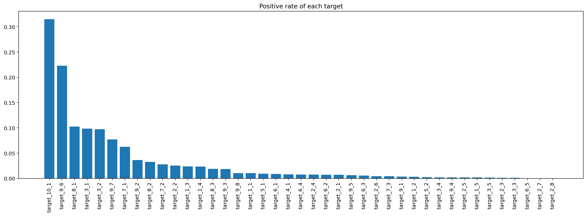

График показывает дисбаланс классов. Видно, что часть продуктов встречается заметно чаще других.

### 2. Размеры кластеров

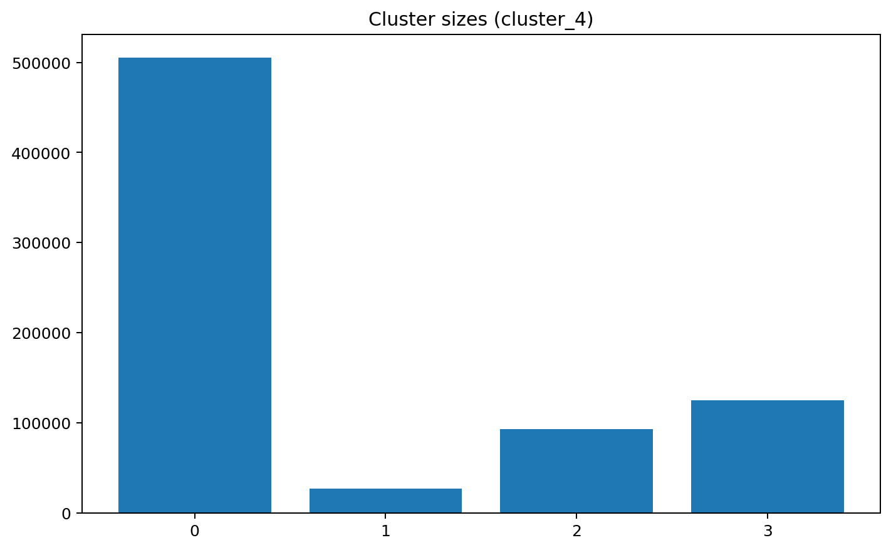

Показывает, насколько равномерно данные разбиваются на клиентские сегменты.

### 3. Heatmap cluster x target

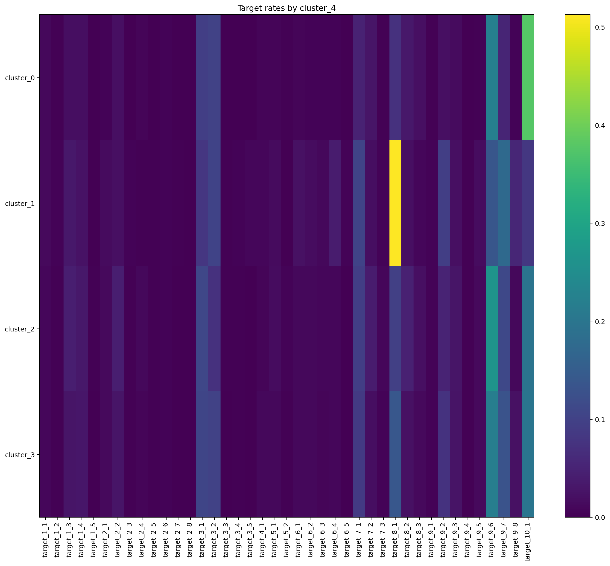

Один из главных графиков решения. Он показывает, какие продукты характерны для каждого кластера.

### 4. PCA train vs test

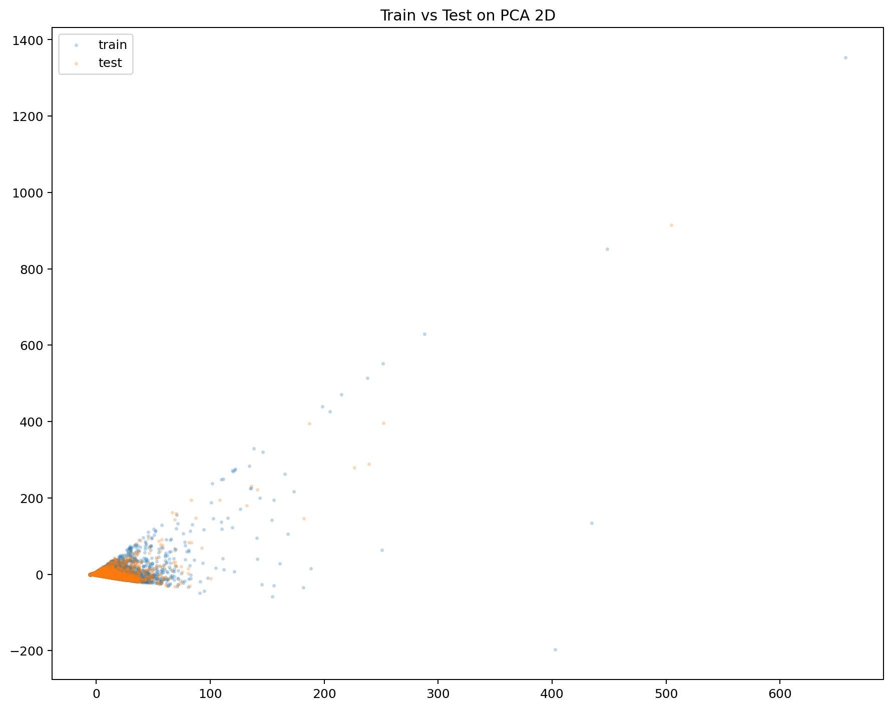

График нужен для визуальной проверки того, что train и test лежат в похожем пространстве.

### 5. PCA train vs test после percentile clipping

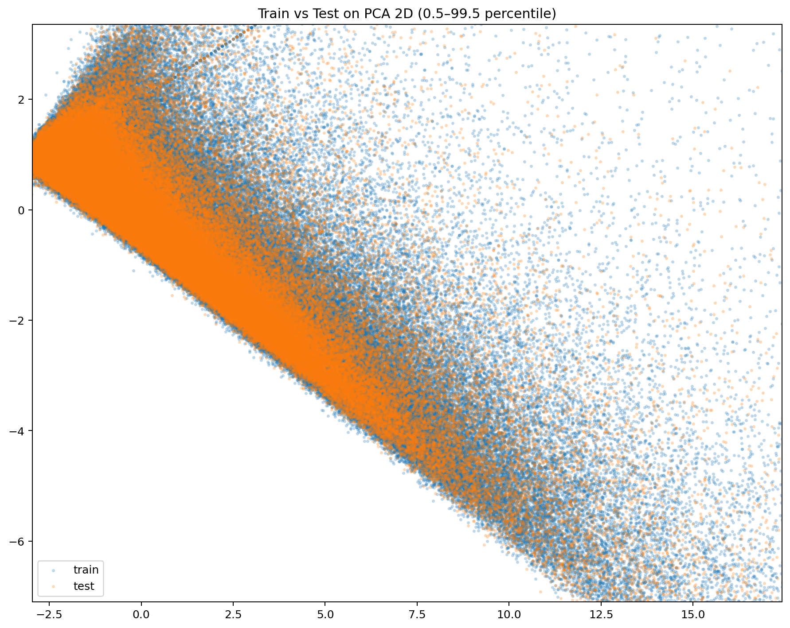

Этот вариант убирает хвостовые выбросы и делает основную структуру данных более читаемой.

### 6. PCA с цветом по кластерам

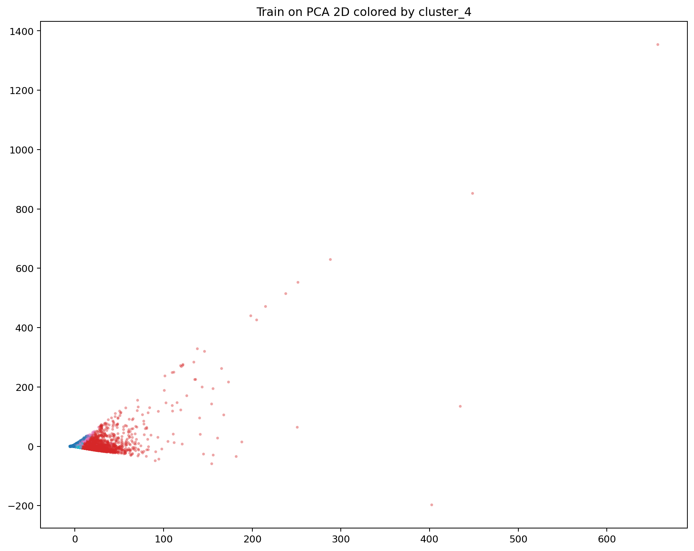

Показывает, как кластеризация ложится на сжатое двумерное пространство.

### 7. PCA с цветом по кластерам после clipping

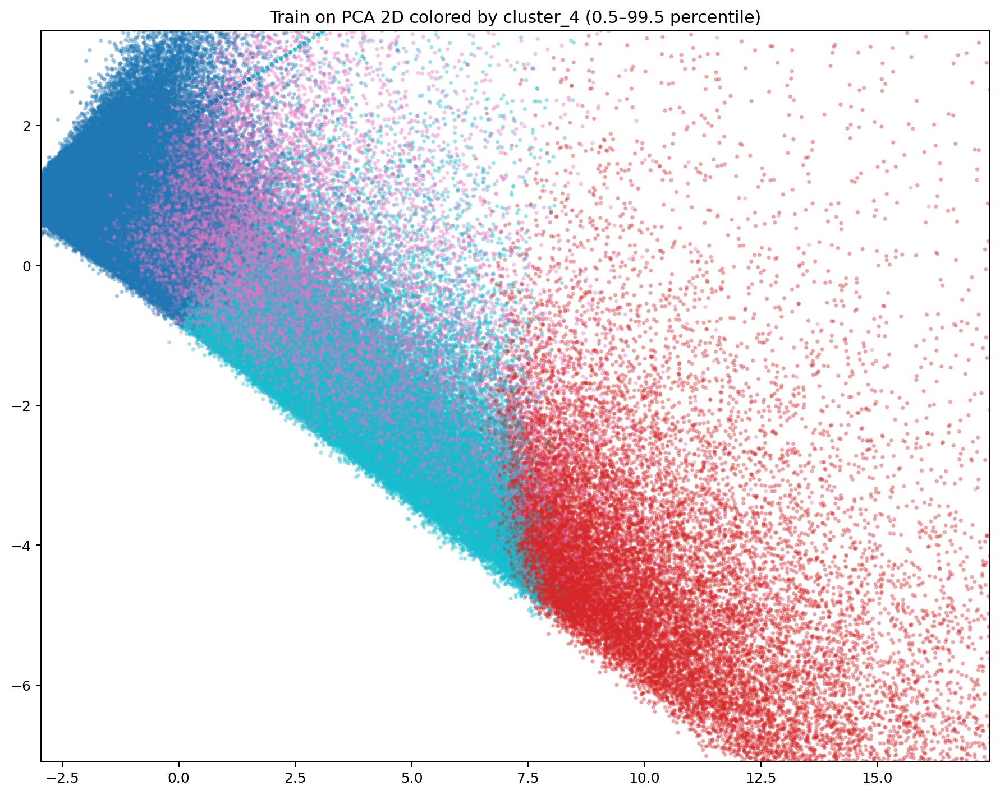

Более удобная версия для презентации и сайта.

### 8. Топ признаков по missingness

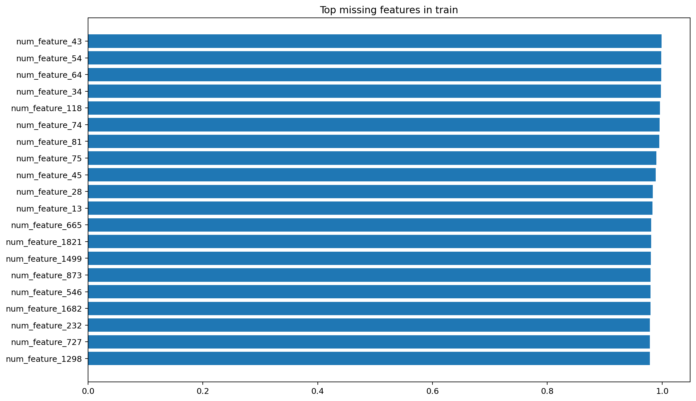

Помогает быстро понять, какие признаки сильнее всего страдают от пропусков.

### 9. Топ признаков по drift

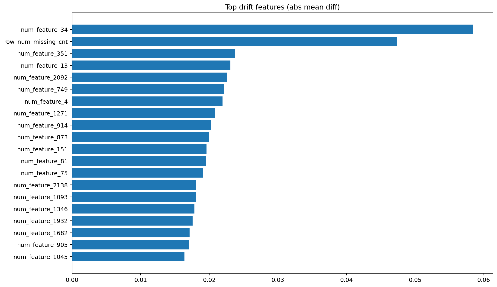

Показывает признаки, у которых сильнее всего отличается распределение между train и test.

### 10. Глобальная важность признаков

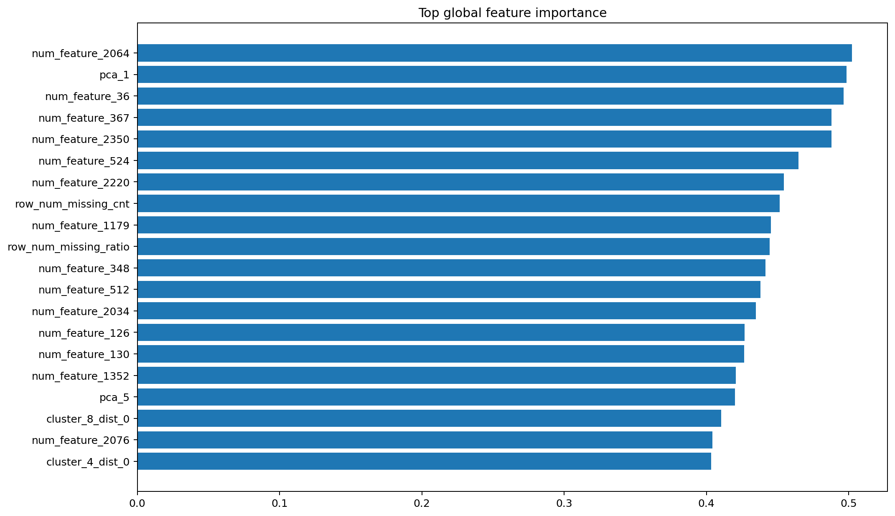

Показывает признаки, которые одновременно:
- полезны для таргетов
- разделяют кластеры
- дают сильный аналитический сигнал

### 11. Топ cluster-separating features

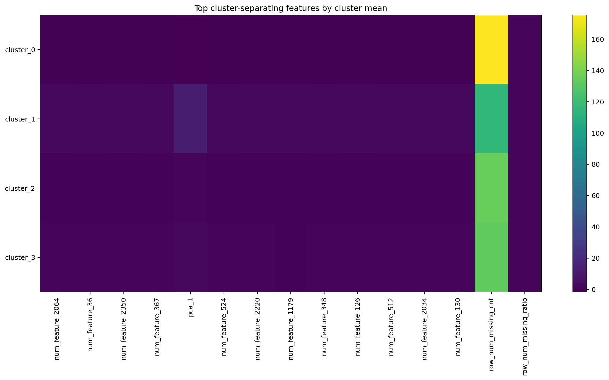

Показывает средние значения наиболее сегментообразующих признаков в каждом кластере.

### 12. Распределения признаков по кластерам и классам

Примеры:

- `./plots/dist_num_feature_2064_by_cluster.png`
- `./plots/dist_num_feature_367_by_cluster.png`
- `./plots/dist_num_feature_36_by_cluster.png`
- `./plots/dist_pca_1_by_cluster.png`

И по target:

- `./plots/dist_num_feature_2064_by_class_target_10_1.png`
- `./plots/dist_num_feature_2064_by_class_target_9_6.png`
- `./plots/dist_num_feature_36_by_class_target_10_1.png`
- `./plots/dist_num_feature_36_by_class_target_9_6.png`
- `./plots/dist_pca_1_by_class_target_10_1.png`
- `./plots/dist_pca_1_by_class_target_9_6.png`

Эти графики нужны для локального анализа:
- насколько конкретный признак отделяет класс 0 от класса 1
- как ведет себя признак в разных сегментах
- насколько PCA-компоненты несут дискриминирующую информацию

---

## Экспорт данных для сайта

Сайт использует отдельный экспортируемый слой данных.

### Что экспортируется

#### Карты клиентов

- `clients_map.csv`
- `clients_map_compressed.csv`

#### Карты target

- `target_map_raw.csv`
- `target_map_compressed.csv`

#### Карточки

- `feature_summary_cards.csv`
- `target_summary_cards.csv`
- `cluster_summary_cards.csv`

#### Структурные таблицы

- `cluster_summary.csv`
- `cluster_target_rates_export.csv`
- `target_cluster_cards.csv`
- `top_feature_pairs.csv`

#### Распределения

- `numeric_distribution_by_class_long.csv`
- `numeric_distribution_by_cluster_long.csv`

#### Метаданные

- `export_meta.json`

### Зачем нужен отдельный export layer

Frontend не должен читать тяжелые parquet напрямую. Поэтому делается легкий слой CSV и JSON, готовый к использованию:

- на Next.js сайте
- в интерактивном дашборде
- в презентации

---

## Структура выходных файлов

### Compact dataset

- `train_compact.parquet`
- `test_compact.parquet`
- `screen_report.csv`
- `target_cols.json`
- `selected_extra_cols.json`
- `dataset_meta.json`
- `compact_dataset.zip`

### Model outputs

- `train_enriched.parquet`
- `test_enriched.parquet`
- `oof_xgb.parquet`
- `oof_cat.parquet`
- `oof_xgb_aux.parquet`
- `oof_blend_raw.parquet`
- `oof_blend_rank.parquet`
- `test_predictions_xgb.parquet`
- `test_predictions_cat.parquet`
- `test_predictions_xgb_aux.parquet`
- `test_predictions_blend_raw.parquet`
- `test_predictions_blend_rank.parquet`
- `submission_xgb.parquet`
- `submission_cat.parquet`
- `submission_xgb_aux.parquet`
- `submission_blend_raw.parquet`
- `submission_blend_rank.parquet`
- `submission_blend_rank_fixed.parquet`

### EDA / Site artifacts

Папка `cybershelf_analysis_site/`:

- `plots/`
- `tables/`
- `site_export/`
- `summary.json`

Архив:

- `cybershelf_analysis_site.zip`

---

## Как запускать

### Режим 1. Полный запуск

Запускаются все этапы:

- сборка compact dataset
- обучение модели
- фикса submission
- EDA
- zip сайта

Подходит, если нужен полный end-to-end pipeline.

### Режим 2. Только обучение

Если compact dataset уже собран, можно отключить:

- `BUILD_COMPACT = False`

### Режим 3. Только EDA

Если уже есть `train_enriched.parquet` и `test_enriched.parquet`, можно запустить только аналитический слой.

---

## Основные конфиги

### Data configs

- `TOP_EXTRA`
- `BATCH_SIZE`
- `SAMPLE_TRAIN`
- `SAMPLE_TEST`

### Model configs

- `FAST_MODE`
- `USE_GPU`
- `N_SPLITS`
- `BLEND_TEMPERATURE`

### EDA configs

- `TRAIN_SAMPLE_FOR_SITE`
- `TEST_SAMPLE_FOR_SITE`
- `IMPORTANCE_SAMPLE`
- `DIST_SAMPLE`
- `GRID_SIZE`

### Pipeline flags

- `BUILD_COMPACT`
- `TRAIN_MODEL`
- `FIX_SUBMISSION`
- `RUN_EDA`
- `ZIP_EDA`

---
